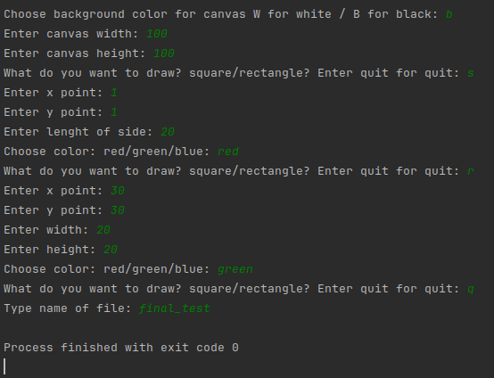
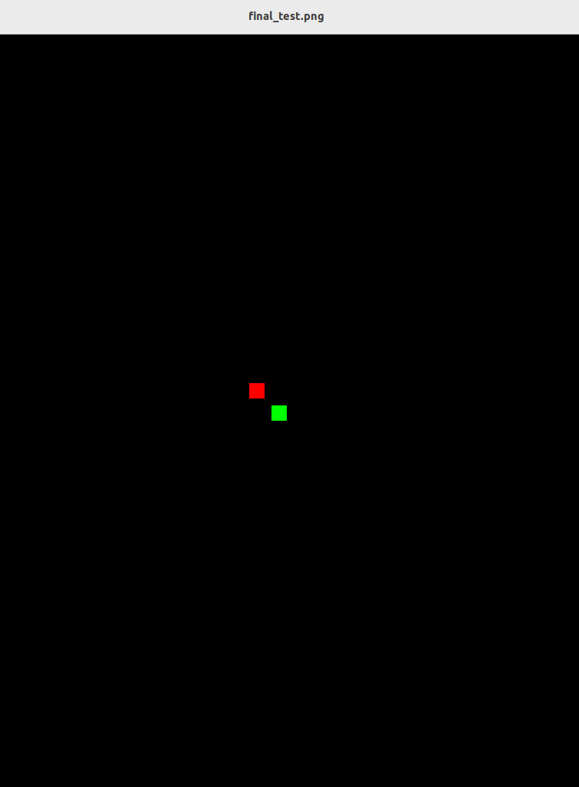

### Math Painting

## Description: 
An app that lets the user provide the start coordinates of geometrical shapes such as
squares and rectangles, their dimensions, and their colors, and the program produces an image file of user chosen name
canvas with all the geometrical shapes drawn in it. This project was ment to help me more understand OOP principles.

## Libraries:
All libraries can be found in requirements.txt file.
numpy==1.19.5
Pillow==8.0.1

## How to run:
Program will take some input of yours, like a x coordinates or length / width of some of geometrical shapes.
You can draw only square or rectangle, but you can draw them how many times you want to. After you are done
with your image, just type quit on prompt and program will ask you for the name for a file. Name type without
any .png or .jpg.

## Program output:
Program will autogenerate a .png file, named by user. There is how looks like our testing file.

